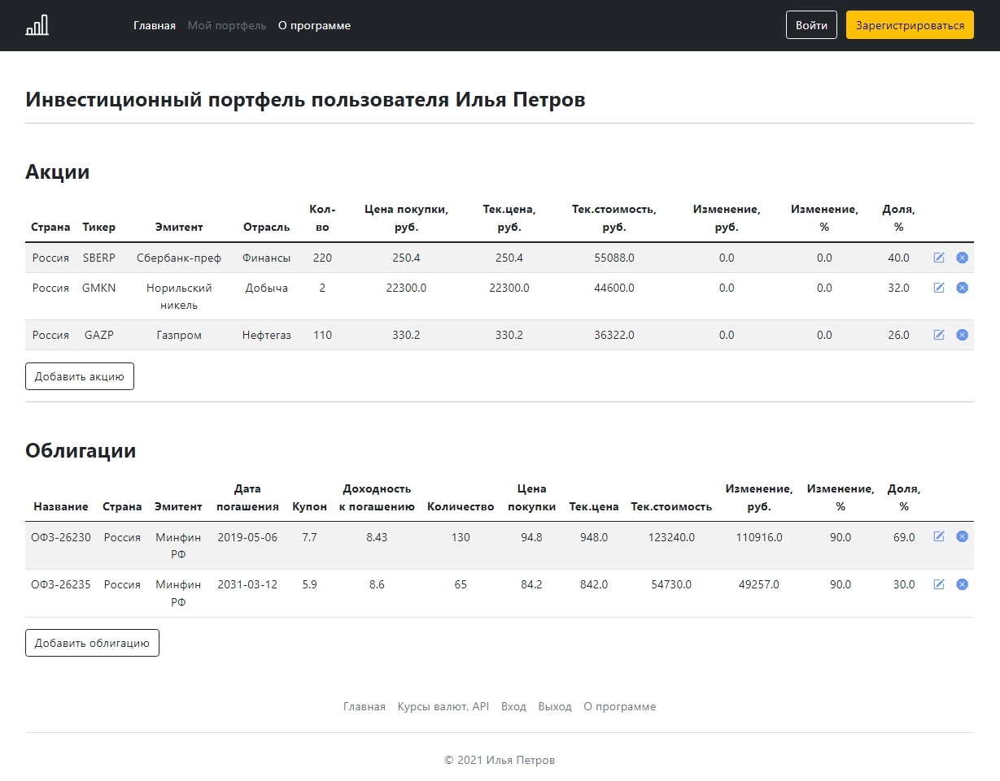

## Учёт персональных инвестиций

Учебный проект, разработанный в рамках курса «Введение в разработку корпоративных приложений на Java». 

*Университет Иннополис*

### Функционал

Пользователь может зарегистрироваться, указав имя, email (будет использоваться как логин) и пароль.
Зарегистрированный пользователь может вести учёт личных инвестиций, добавляя, редактируя и удаляя ценные бумаги (CRUD).
Также у него есть возможность инвестиционные портфели других участников системы и делиться url-ссылкой на свой портфель.
Незарегистрированный пользователь только просматривает портфели участников. 

В системе предусмотрена учётная запись админа, который может редактировать портфели любых пользователей и удалять пользователей.

Приложение позволяет учитывать два вида ценных бумаг - акции и облигации.
Приложение отображает текущую стоимость активов за счёт API БКС и подсчитывает полученную прибыль / убыток по каждой позиции.
Анализируется площадка, на которой торгуется бумага, в зависимости от чего рассчитывается её цена с учётом курса рубля.

### Технологии и ресурсы

* Общие данные
    - Язык Java 8
    - Spring Boot
    - Spring Security
    - Intellij IDEA
    - Деплой Heroku, Tomcat
    - Сборка Maven
    
    
* Работа с базой данных
    - Postgres
    - JDBC
    - ORM Hibernate
    - Spring Data JPA
  
    
* Фронтенд и шаблонизация
    - JSP
    - JSTL
    - Bootstrap
    
    
* Внешние API
    - API БКС - получение курса ценной бумаги
    - API ЦБ РФ - получение курса рубля

* Покрытие тестами
    - Для слоя models - JUnit5
    - Для слоя repositories - DataJpaTest + H2
    - Для слоя services - Mockito
    - Для слоя controller - WebMvcTest
    
---

Адрес приложение в сети - [investment-web](https://investment-web.herokuapp.com/)

---

  

                 